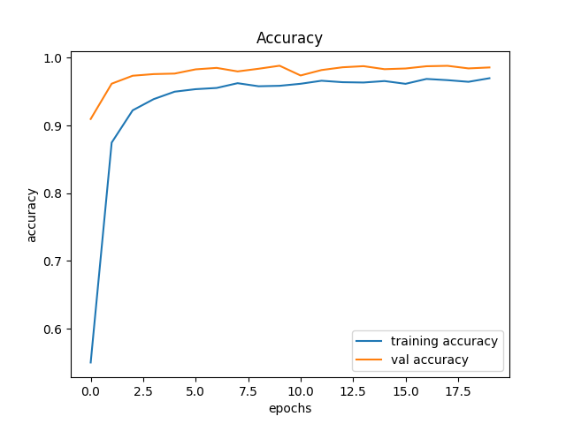
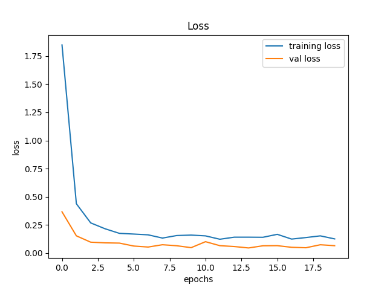

# Traffic Sign Classification

## Usage

```bash
git clone https://github.com/Nabagata/traffic-sign-classification.git
```
Download the [GTSRB](https://www.kaggle.com/meowmeowmeowmeowmeow/gtsrb-german-traffic-sign) (German Traffic Sign Recognition Benchmark) and unzip it in the current folder

```bash
python traffic_sign.py
```
## Results
### Accuracy 

### Loss

